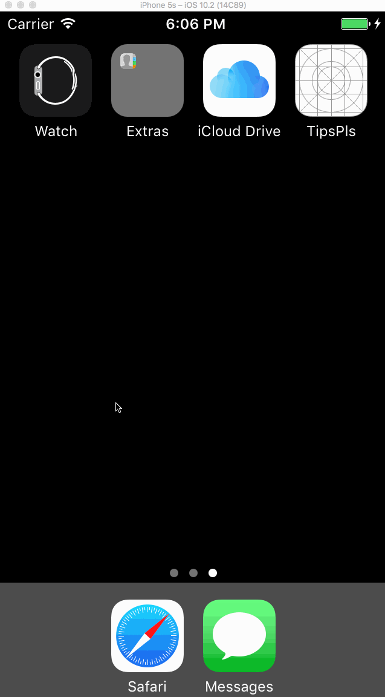

# Pre-work - TipsPls

TipsPls is a tip calculator application for iOS.

Submitted by: Vivien Siu

Time spent: 1.5 hour spent in total

## User Stories

The following **required** functionality is complete:
* [X] User can enter a bill amount, choose a tip percentage, and see the tip and total values.

The following **optional** features are implemented:
* [X] Custom font
* [ ] UI animations
* [ ] Making sure the keyboard is always visible and the bill amount is always the first responder. This way the user doesn't have to tap anywhere to use this app. Just launch the app and start typing.

The following **additional** features are implemented:

- [ ] List anything else that you can get done to improve the app functionality!

## Video Walkthrough 

Here's a walkthrough of implemented user stories:

GIF created with [LiceCap](http://www.cockos.com/licecap/).

## Notes

Describe any challenges encountered while building the app.

1) While following the video to build the Tip Calculator app, when attempting to drag the Segmented Control to hook up Value Changed with the calculateTip function, XCode did not highlight the function as shown on the video.  However, I was able to inspect my code against the video and fix it by changing the calculateTip argument type from Any to AnyObject.  I tried looking up the difference between Any and AnyObject online and why it would trigger the hook up to fail in Xcode, there were a lot of explanation on difference between Any vs. AnyObject, but there wasn't an answer to why it would cause the drag/hooking up to fail in Xcode (I'm still curious!).

## License

    Copyright 2017 Vivien Siu

    Licensed under the Apache License, Version 2.0 (the "License");
    you may not use this file except in compliance with the License.
    You may obtain a copy of the License at

        http://www.apache.org/licenses/LICENSE-2.0

    Unless required by applicable law or agreed to in writing, software
    distributed under the License is distributed on an "AS IS" BASIS,
    WITHOUT WARRANTIES OR CONDITIONS OF ANY KIND, either express or implied.
    See the License for the specific language governing permissions and
    limitations under the License.